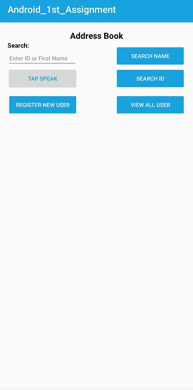
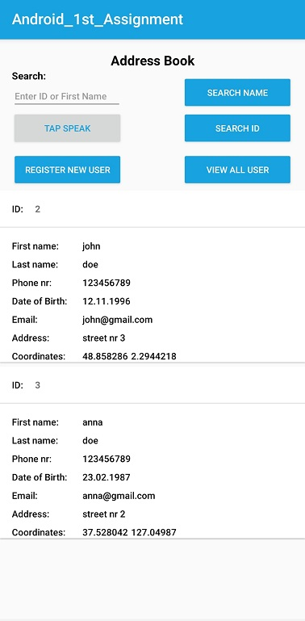
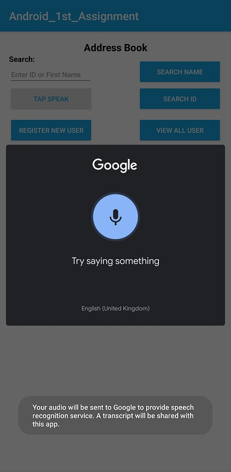
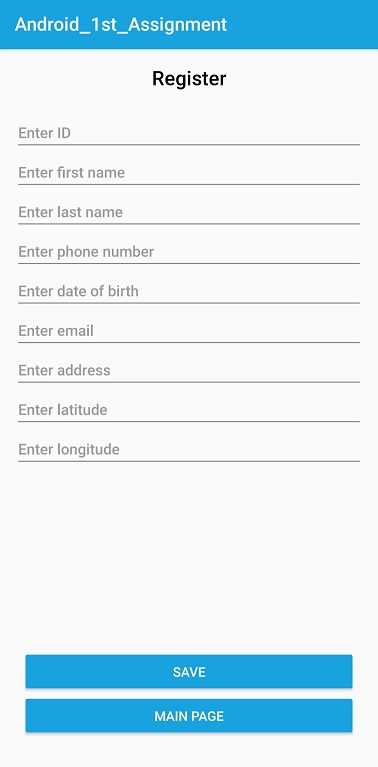
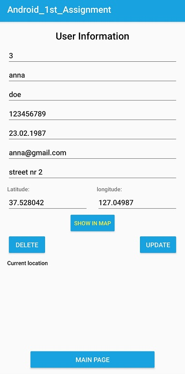

# Address Book

 Android Address Book App

App support all basic DB operations, such as:

<ul><li>Insertion of a new contact</li>
<li>Viewing all available contacts</li>
<li>Searching for a specific contactt</li>
<li>Searching for a specific contact with (speech to text)</li>
<li>Updating a specific contact’s details</li>
 <li>Deleting a contact</li></ul>

Tools used for building this application:
<ul><li>Android studio</li>
 <li>SQLite Database(for storing data)</li>
 </ul>
 
 
 
 Some screenshots of the app
 
  1 
  
 
 
 
 2
 
 
 
 3
 
  
  
  4
  
   
   
   5
   
   
 
 
